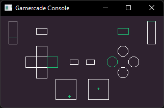

# Gamercade Gamepad Test

A [Gamercade Console](https://github.com/gamercade-io/gamercade_console) game. Learn more at [Gamercade](https://gamercade.io).

A test for controller support.

Pressing buttons or moving analog sticks will adjust what is displayed on the screen.

## How to Run

> Download `gamepad.gcrom` and run it in the Gamercade Console.

## Building from Source

1. Clone the project and build it via `cargo build`
1. The `.wasm` file will be output to `/target/wasm32-unknown-unknown/debug`.
1. Follow the steps at on the gamercade_console [readme](https://github.com/gamercade-io/gamercade_console#bundling-a-game-with-the-editor---how-to-create-a-gcrom-file).

